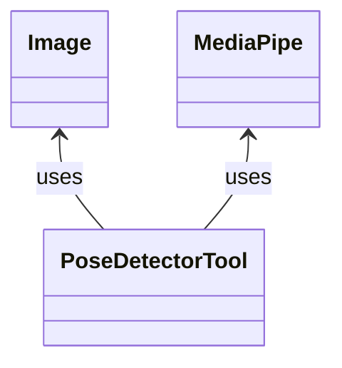

# Aufgabe - PoseDetector
Ziel ist es in einem Bild oder auch einem Videostream, eine Person und vordefinierte Posen zu erkennen.
Folgende Posen sollen erkannt werden können:
- rechte Hand oben
- linke Hand oben
- beide Hände oben
 

## Klassenaufbau
Als erstes hat man ein Hauptmodul, hier **PoseDetectorTool**.
Dieses verwendet ein oder mehrere Bilder **Image** und soll diese mit **MediaPipe** analysieren.
Eine  detektierte Pose soll ausgegeben werden. 



### Basic Implementierung
Für einen ersten Entwurf kann ein Python Skript geschrieben werden, welches ein Bild einliest,
und anschliessend durch MediaPipe analysiert und visualisiert wird.

{: width="30%" align="top" } {: width="60%"}

#### Hints
Um Bilder einzulesen kann die [OpenCV](https://opencv.org/) Bibliothek verwendet werden.


```bash
$> pip install opencv-python
```

```python
import cv2

# Read image
image = cv2.imread('path/to/image.jpg')
# Write image
cv2.imwrite('path/to/save_image.jpg', image)

# Display image
cv2.imshow('Image name', image)
cv2.waitKey(0)
cv2.destroyAllWindows()
```

Die Bibliothek [MediaPipe](https://ai.google.dev/edge/mediapipe/solutions/vision/pose_landmarker) kann zur Posenerkennung verwendet werden.

```bash
$> pip install mediapipe
```

Code Beispiele Können im [MediaPipe Python Guide](https://ai.google.dev/edge/mediapipe/solutions/vision/pose_landmarker/python) und im [DemoCode](https://github.com/google-ai-edge/mediapipe-samples/blob/main/examples/pose_landmarker/python/%5BMediaPipe_Python_Tasks%5D_Pose_Landmarker.ipynb) auf GitHub gefunden werden.


